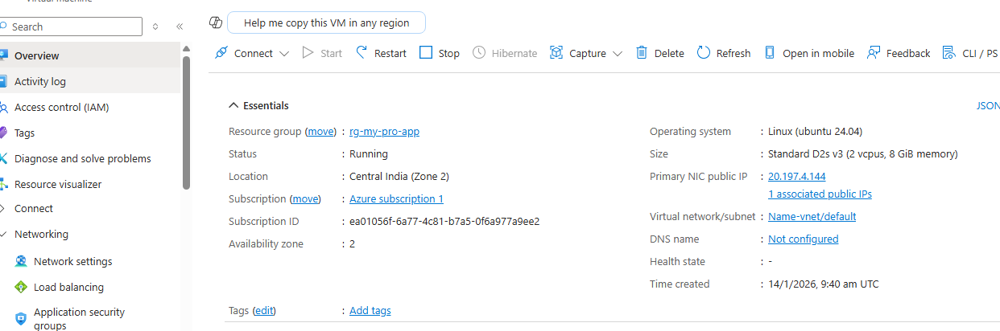
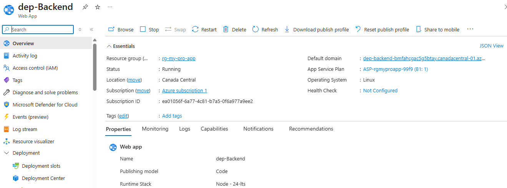
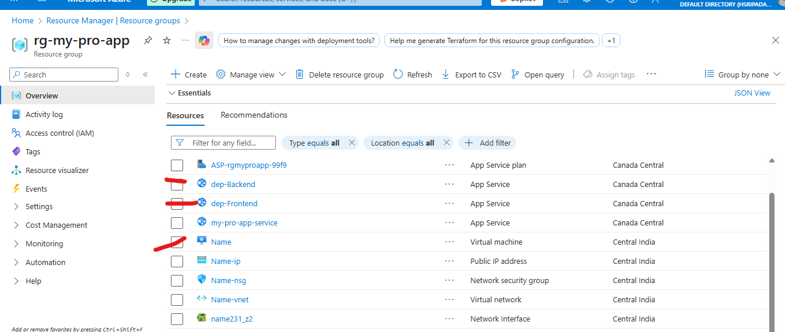

# Azure Cloud Infrastructure: Multi-App Departmental Stack

This repository documents the deployment of a professional 3-tier application stack on Microsoft Azure. This project demonstrates proficiency in managing **Resource Groups**, **Platform as a Service (PaaS)**, and **Infrastructure as a Service (IaaS)** within a unified departmental environment.

--- 

## 🏗️ Phase 1: Infrastructure & Admin Setup
The project began by establishing a centralized management boundary to host departmental services, starting with a Linux-based administrative hub.

### 1. Ubuntu Server Configuration (IaaS)
To maintain full control over internal tools, I deployed an **Ubuntu 24.04 LTS** Virtual Machine. I accessed the server via SSH and performed system-wide updates to ensure a secure and stable baseline.

### 2. Virtual Machine Management
The VM was successfully provisioned in the `Central India` region. This server acts as the department's "Admin Controller" for custom scripts and database management.

---

## 🐚 Phase 2: Linux System Administration
I utilized the Command Line Interface (CLI) to manage the remote server.
* **Tasks:** Executed `sudo apt update` to synchronize package repositories.
* **Outcome:** Established a hardened environment for hosting departmental internal tools.

---

## 📁 Phase 3: Departmental Multi-App Deployment (PaaS)
I extended the infrastructure to host a high-availability application stack. To optimize costs, I utilized **Resource Density** by hosting multiple services on a single compute resource.

### 1. Managed Backend Service
Deployed `dep-Backend` as a Node.js web app to handle API logic. It is verified as "Running" in the `Canada Central` region.

### 2. Managed Frontend Service
Deployed `dep-Frontend` to serve as the user interface. Both apps share the same **App Service Plan**, demonstrating cloud cost optimization.

---

## 📊 Phase 4: Final Inventory & Architecture
The result is a fully integrated ecosystem where all networking, compute, and storage assets are managed under the `rg-my-pro-app` Resource Group.

### Complete Resource Inventory
The inventory includes 11 active resources, including Virtual Networks (VNet), Network Security Groups (NSG), Public IPs, and Web Apps, working in harmony.

---

## 🧠 What I Learnt From This Project

* **Hybrid Cloud Service Models:** I gained a deep understanding of when to use **PaaS** for rapid web scaling (App Services) versus **IaaS** for tasks requiring full root access and custom OS configurations (Virtual Machines).
* **Resource Density & Cost Management:** I mastered the ability to maximize compute resources by hosting multiple applications on a **single Shared App Service Plan**, significantly reducing cloud overhead costs for the department.
* **Logical Isolation & Organization:** I practiced the professional use of **Resource Groups** to isolate departmental assets, making it easier to manage security rules via **Network Security Groups (NSGs)** and monitor the health of an entire stack in one view.
* **Linux Server Hardening:** I gained hands-on experience in remote server management, learning how to secure a fresh Ubuntu installation via CLI and ensuring all security patches are synchronized before deployment.
* **Global Infrastructure Management:** I learned how to provision and verify cloud resources across different geographical regions (`Canada Central` and `Central India`) to ensure high availability.

---
**Architected by [HSRIPADARAO1108](https://github.com/HSRIPADARAO1108)**
