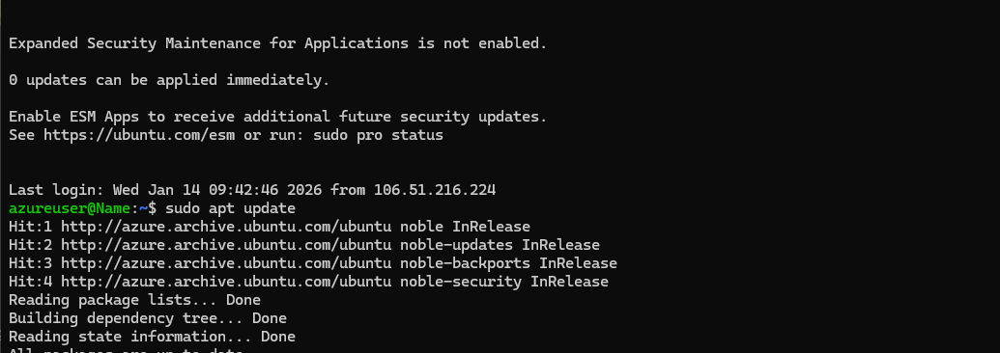

# Azure Cloud Infrastructure: Multi-App Departmental Stack

This repository documents the deployment of a full application stack on Microsoft Azure, demonstrating proficiency in **Resource Groups**, **Platform as a Service (PaaS)**, and **Infrastructure as a Service (IaaS)**.

---

## 🏗️ Phase 1: Infrastructure Foundations
The project began by establishing a centralized management boundary to host departmental services.

### 1. Resource Organization
All assets are contained within the `rg-my-pro-app` resource group. This ensures that the Front-end, Back-end, and Admin tools are managed as a single logical department for billing and security.

### 2. Virtual Machine Provisioning (IaaS)
A Linux environment was deployed to handle administrative tasks and custom internal tools.
* **OS:** Ubuntu 24.04 LTS (Noble Numbat)
* **Status:** Deployment successfully validated via Azure Resource Manager.

---

## 🐚 Phase 2: Linux System Administration
I accessed the Ubuntu server via SSH to perform critical environment configurations and updates.
* **Tasks:** Executed `sudo apt update` to synchronize package repositories.
* **Outcome:** Established a secure and updated baseline for hosting departmental internal tools.

---

## 📁 Phase 3: Departmental Multi-App Deployment
I extended the environment to host a 3-tier departmental application stack, optimizing for both performance and cost.

### 1. Application Components
* **Front-End:** `dep-Frontend` (Managed App Service)
* **Back-End:** `dep-Backend` (Managed App Service)
* **Admin Tool:** `Name` (Ubuntu Linux VM)

### 2. Backend Service Status
The backend API was deployed using a Node.js runtime, verified as "Running" within the Canada Central region.

### 3. Complete Resource Inventory
The following inventory shows the full departmental stack, including Networking (VNet/NSG), Storage, and Compute resources working in harmony.

---

## 🧠 Core Competencies Demonstrated
* **Hybrid Cloud Architecture:** Combining PaaS and IaaS within a single environment.
* **Resource Optimization:** Utilizing a shared App Service Plan to reduce departmental costs.
* **Linux CLI:** Managing remote servers and package dependencies via SSH.

---
**Architected by [HSRIPADARAO1108](https://github.com/HSRIPADARAO1108)**
